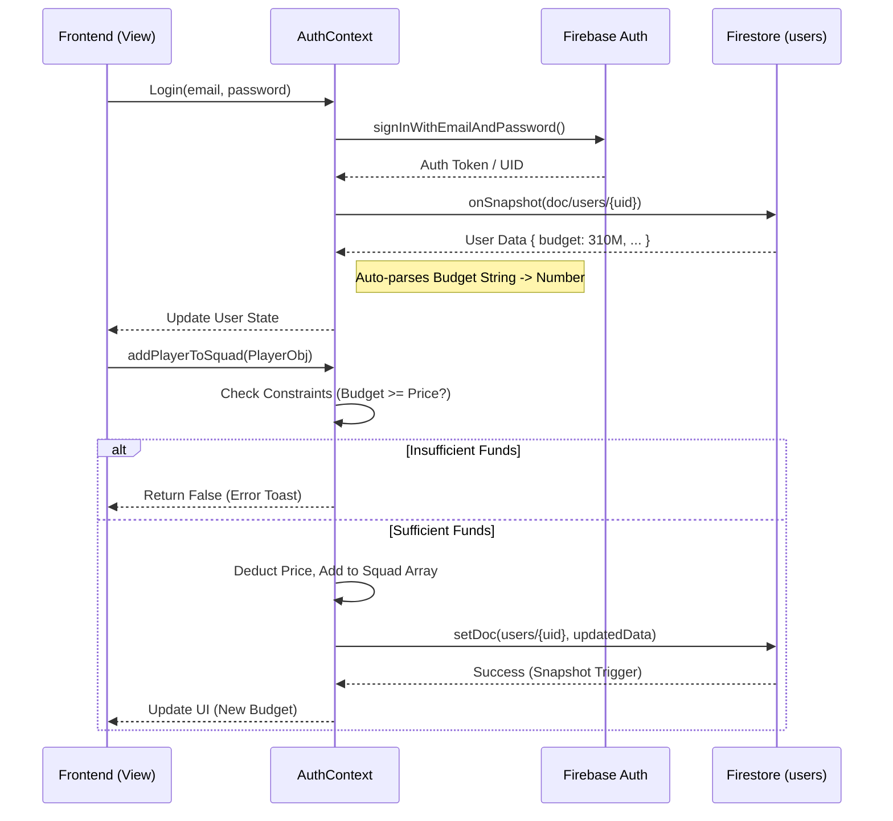
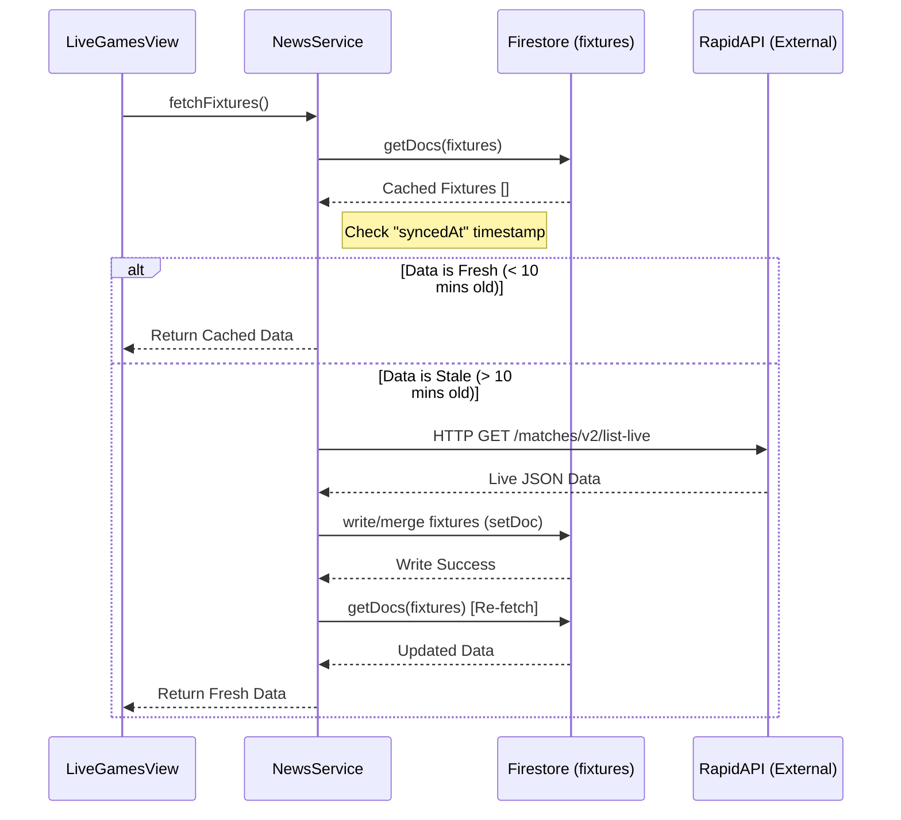

# System Architecture & Data Flow

This document visualizes how data moves through the Squad Strategy League application, covering internal state management, database persistence, and external API integration.

## 1. High-Level Data Flow Architecture (Component Diagram)

This diagram shows the major components and how they interact.

```mermaid
graph TD
    %% Nodes
    subgraph Client [Frontend Application (React/Vite)]
        UI[User Interface Views]
        
        subgraph Logic_Layer [Logic Layer]
            AuthCtx[AuthContext <br/>(User State & Budget Manager)]
            NewsSvc[News/Fixture Service <br/>(Data Fetcher)]
            StaticData[playersData.ts <br/>(Simulated Player DB)]
        end
    end

    subgraph Backend [Firebase Backend]
        FirebaseAuth[Firebase Auth]
        
        subgraph Database [Firestore DB]
            FS_Users[(Collection: users)]
            FS_News[(Collection: news)]
            FS_Fixtures[(Collection: fixtures)]
        end
    end

    subgraph External [External APIs]
        RapidAPI[RapidAPI <br/>(LiveScores & Fixtures)]
        NewsAgg[News APIs <br/>(GNews/NewsAPI/Jina)]
    end

    %% Styling
    classDef internal fill:#e1f5fe,stroke:#01579b,stroke-width:2px;
    classDef external fill:#fbe9e7,stroke:#bf360c,stroke-width:2px;
    classDef database fill:#e8f5e9,stroke:#1b5e20,stroke-width:2px;
    
    class UI,AuthCtx,NewsSvc,StaticData internal;
    class RapidAPI,NewsAgg external;
    class FirebaseAuth,FS_Users,FS_News,FS_Fixtures database;

    %% Relationships
    
    %% Auth Flow
    UI -- "1. Action: Login/Actions" --> AuthCtx
    AuthCtx -- "2. Verify Creds" --> FirebaseAuth
    AuthCtx <-- "3. Read/Write Profile" --> FS_Users
    
    %% Player Market Flow (Internal)
    UI -- "4. Query Players" --> StaticData
    UI -- "5. Buy/Sell Request" --> AuthCtx
    AuthCtx -- "6. Validate Budget" --> AuthCtx
    
    %% External Data Flow (Sync Pattern)
    UI -- "7. View Live Games" --> NewsSvc
    NewsSvc -- "8. Check Cache" --> FS_Fixtures
    
    NewsSvc -- "9. Fetch (if stale)" --> RapidAPI
    NewsSvc -- "9. Fetch (if stale)" --> NewsAgg
    
    RapidAPI -- "10. JSON Data" --> NewsSvc
    NewsSvc -- "11. Save/Cache" --> FS_Fixtures
    NewsSvc -- "11. Save/Cache" --> FS_News
```

## 2. Detailed Data Sequences

### A. User Profile & Budget Flow (Internal + DB)
**Scenario:** A user logs in and buys a player.



### B. Live Games Sync Flow (External + Cache)
**Scenario:** User opens the "Live Games" tab.


